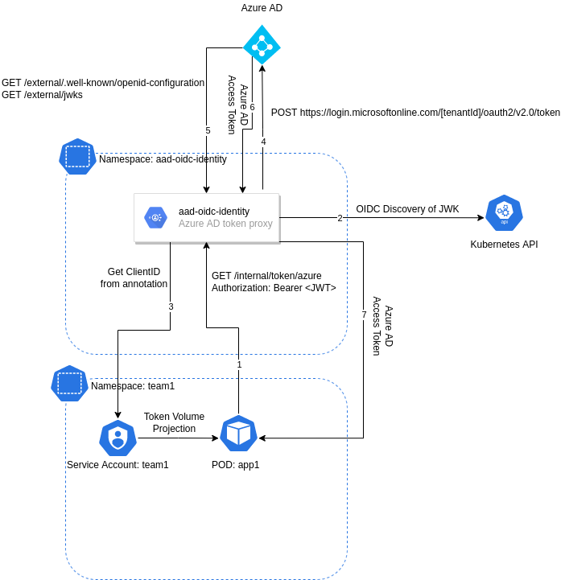

# aad-oidc-identity

**PLEASE NOTE**: This is a pre-alpha proof of concept. The name is just a placeholder for something meaningful in the future and borrowed from [aad-pod-identity](https://github.com/Azure/aad-pod-identity).

This proof of concept aims to showcase the new federated identity credentials in Azure AD working together with Service Account Token Volume Projection and Service Account Issuer Discovery in Kubernetes to create a secure way for applications to get Azure AD tokens, kind of like [IRSA](https://docs.aws.amazon.com/eks/latest/userguide/iam-roles-for-service-accounts.html).

## POC TODO

- [x] Initial project setup
- [x] Service Account Issuer Discovery with go-oidc-middleware
- [x] External endpoint for OIDC Metadata (`/.well-known/openid-configuration`)
- [x] External endpoint for JWKs (`/jwks`)
- [x] Request Azure AD access tokens using federated identity credentials with JWT created with JWK
- [x] Internal endpoint for token switching from Kubernetes JWT to Azure AD JWT (`/token/azure`)
- [x] Create a small overview diagram
- [x] Document the flow to showcase the functionality
- [x] Client ID discovery through annotation
- [x] Tenant ID discovery through annotation
- [x] Scope discovery through annotation
- [x] Store JWK in Kubernetes secret
- [x] Add AWS support
- [x] Add Google support
- [ ] Document AWS support
- [ ] Document Google support

## AWS NOTES

Get your thumbprint by following this guide: https://docs.aws.amazon.com/IAM/latest/UserGuide/id_roles_providers_create_oidc_verify-thumbprint.html

```bash
ISSUER=aks-oidc.domain.com
THUMBPRINT=$(echo | openssl s_client -connect ${ISSUER}:443 2>&- | openssl x509 -fingerprint -noout | sed 's/://g' | awk -F= '{print tolower($2)}')
aws iam create-open-id-connect-provider --url https://${ISSUER} --thumbprint-list ${THUMBPRINT} --client-id-list api://AWSTokenExchange
```

Request token using:

```shell
TOKEN=$(cat /var/run/secrets/tokens/oidc-token)
curl -v -H "Authorization: Bearer ${TOKEN}" -k http://aad-oidc-identity/token/aws
``` 

## GOOGLE NOTES

When setting up the trust from the external identity to the Service Account, go into IAM > Service Accounts > [service account] > Permissions.

From there, click "Grant Access" and set the "New Principal to:

`principal://iam.googleapis.com/projects/GOOGLE_PROJECT_ID/locations/global/workloadIdentityPools/GOOGLE_POOL_ID/subject/system:serviceaccount:K8S_NAMESPACE:K8S_SERVICE_ACCOUNT_NAME`

Grant it `Workload Identity User` role as well as the roles required to do what it needs.

Request token using:

```shell
TOKEN=$(cat /var/run/secrets/tokens/oidc-token)
curl -v -H "Authorization: Bearer ${TOKEN}" -k http://aad-oidc-identity/token/google
``` 

## Overview

### High level diagram



### Flow

1. Create a private key and store it as a Kubernetes secret (will be used to sign tokens sent to Azure AD)
   ```bash
   step-cli crypto keypair tmp/tls.crt tmp/tls.key --insecure --no-password --kty=RSA --size=2048
   kubectl create secret generic aad-oidc-identity-jwks --from-file=tls.key=tmp/tls.key --from-file=tls.crt=tmp/tls.crt
   ```
1. Azure AD app is created and [federated identity credentials](https://docs.microsoft.com/en-us/graph/api/resources/federatedidentitycredentials-overview?view=graph-rest-beta) is configured
   ```bash
   AZ_APP_OBJECT_ID=$(az ad app show --id 00000000-0000-0000-0000-000000000000 --output tsv --query objectId)
   az rest --method POST --uri 'https://graph.microsoft.com/beta/applications/${AZ_APP_OBJECT_ID}/federatedIdentityCredentials' --body '{"name":"AKSCluster","issuer":"https://aks-oidc.domain.com","subject":"system:serviceaccount:team1:team1","description":"AKS Cluster authentication with aad-oidc-identity","audiences":["api://AzureADTokenExchange"]}'
   ```
1. Service account is created with an annotation for the client id
   ```yaml
   apiVersion: v1
   kind: ServiceAccount
   metadata:
     annotations:
       aad-oidc-identity.xenit.io/client-id: 00000000-0000-0000-0000-000000000000
       aad-oidc-identity.xenit.io/role-arn: arn:aws:iam::123456789:role/test
     namespace: team1
     name: team1
   ```
1. A pod is created using the service account and [Service Account Token Volume Projection](https://kubernetes.io/docs/tasks/configure-pod-container/configure-service-account/#service-account-token-volume-projection)
   ```yaml
   apiVersion: v1
   kind: Pod
   metadata:
     name: app
     namespace: team1
   spec:
     serviceAccountName: team1
     containers:
       - image: nginx:alpine
         name: app
         volumeMounts:
           - mountPath: /var/run/secrets/tokens
             name: oidc-token
     volumes:
       - name: oidc-token
         projected:
           sources:
             - serviceAccountToken:
                 path: oidc-token
                 expirationSeconds: 7200
                 audience: aad-oidc-identity
   ```
1. The pod (app) requests a token from aad-oidc-identity

   ```bash
   TOKEN=$(cat /var/run/secrets/tokens/oidc-token)
   curl -H "Authorization: Bearer ${TOKEN}" -k http://aad-oidc-identity/token/azure
   ```

   _Note: future iterations may include what scopes are requested here._

1. aad-oidc-identity receives the request and validates the token using [Service Account Issuer Discovery](https://kubernetes.io/docs/tasks/configure-pod-container/configure-service-account/#service-account-issuer-discovery)
1. _NOT IMPLEMENTED YET:_ Get Client ID (and Tenant ID if available - maybe even _scopes_ if not included in the request) through the Kubernetes API from the Service Account
1. aad-oidc-identity creates a JWT (with the sub `system:serviceaccount:team1:team1`) and signs it with its own JWK
1. aad-oidc-identity sends the new JWT using the [Client Credentials Grant Flow](https://docs.microsoft.com/en-us/azure/active-directory/develop/v2-oauth2-client-creds-grant-flow#third-case-access-token-request-with-a-federated-credential) to Azure AD
1. Azure AD goes out to the OIDC Discovery Endpoint (metadata) based on the configured `issuer`, `https://aks-oidc.domain.com/.well-known/openid-configuration`, and grabs the `jwks_uri` from the JSON response
1. Azure AD goes out to the `jwks_uri`, `https://aks-oidc.domain.com/jwks`, and downloads the public key(s)
1. Azure AD validates the token based on the downloaded public key(s) and if valid issues an Azure AD access token
1. aad-oidc-identity receives the Azure AD access token and responds with it to the pod (app)
1. The pod now has an Azure AD access token that it can use for whatever tasks needed

## Development

## Testing

```shell
kubectl apply -f test/client-deployment.yaml
kubectl exec -it client /bin/sh
TOKEN=$(cat /var/run/secrets/tokens/oidc-token)
curl -v -H "Authorization: Bearer ${TOKEN}" -k http://aad-oidc-identity/token/azure
```

## Add custom federated identity

```shell
az rest --method POST --uri 'https://graph.microsoft.com/beta/applications/${APP_OBJECT_ID}/federatedIdentityCredentials' --body '{"name":"Testing","issuer":"${EXTERNAL_ISSUER}","subject":"system:serviceaccount:default:default","description":"Testing","audiences":["api://AzureADTokenExchange"]}'
```
